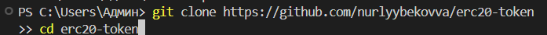
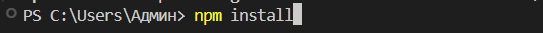
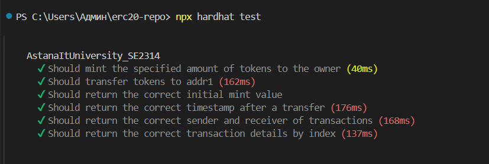
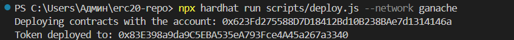
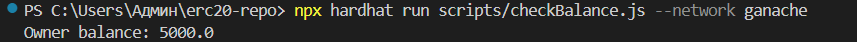
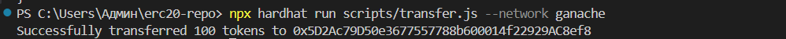
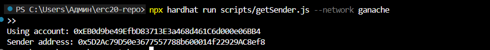
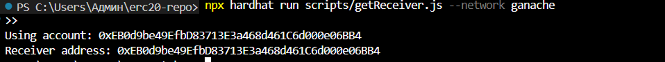
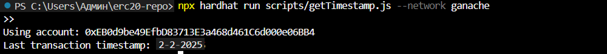

# AstanaItUniversity_SE2314
# Team: Alua Nurlybekova, Alikhan Sailybaev, Zarina Beketova

AstanaItUniversity_SE2314 is a smart contract that implements an ERC-20 token, enhanced with extra features to fetch and display transaction details.

---

## Overview

This contract provides the core functionality of an ERC-20 token, with added capabilities for handling transactions:
- **Token Minting:** When deployed, 2000 tokens are generated and assigned to the creator of the contract.
- **Transaction Logging:** Each transaction is recorded in an event, containing detailed information.
- **Transaction Data Access:**
  - Address of the sender.
  - Address of the recipient.
  - Readable timestamp of the most recent transaction.

---

## Installation Guide

### Clone the Repository

```bash
git clone https://github.com/nurlyybekovva/erc20-token
cd erc20-token
```



---

### Install Required Dependencies

```bash
npm install
```



---

### Run Unit Tests

```bash
npx hardhat test
```



---

### Deploy to Local Network

Set up a local blockchain (e.g., Ganache), and then deploy the contract using:

```bash
npx hardhat run scripts/deploy.js --network ganache
```



---

## Example Usages

### Check Token Balance

Fetch the token balance of the contract’s owner:

```bash
npx hardhat run scripts/checkBalance.js --network ganache
```



---

### Example of a Token Transfer

Send 100 tokens to a different address:

```bash
npx hardhat run scripts/transfer.js --network ganache
```



---

### Retrieve Transaction Details

1. Get the sender’s address from the latest transaction:

   ```bash
   npx hardhat run scripts/getSender.js --network ganache
   ```

   

2. Get the receiver’s address of the most recent transaction:

   ```bash
   npx hardhat run scripts/getReceiver.js --network ganache
   ```

   

3. Fetch the timestamp of the latest transaction:

   ```bash
   npx hardhat run scripts/getTimestamp.js --network ganache
   ```

   

---